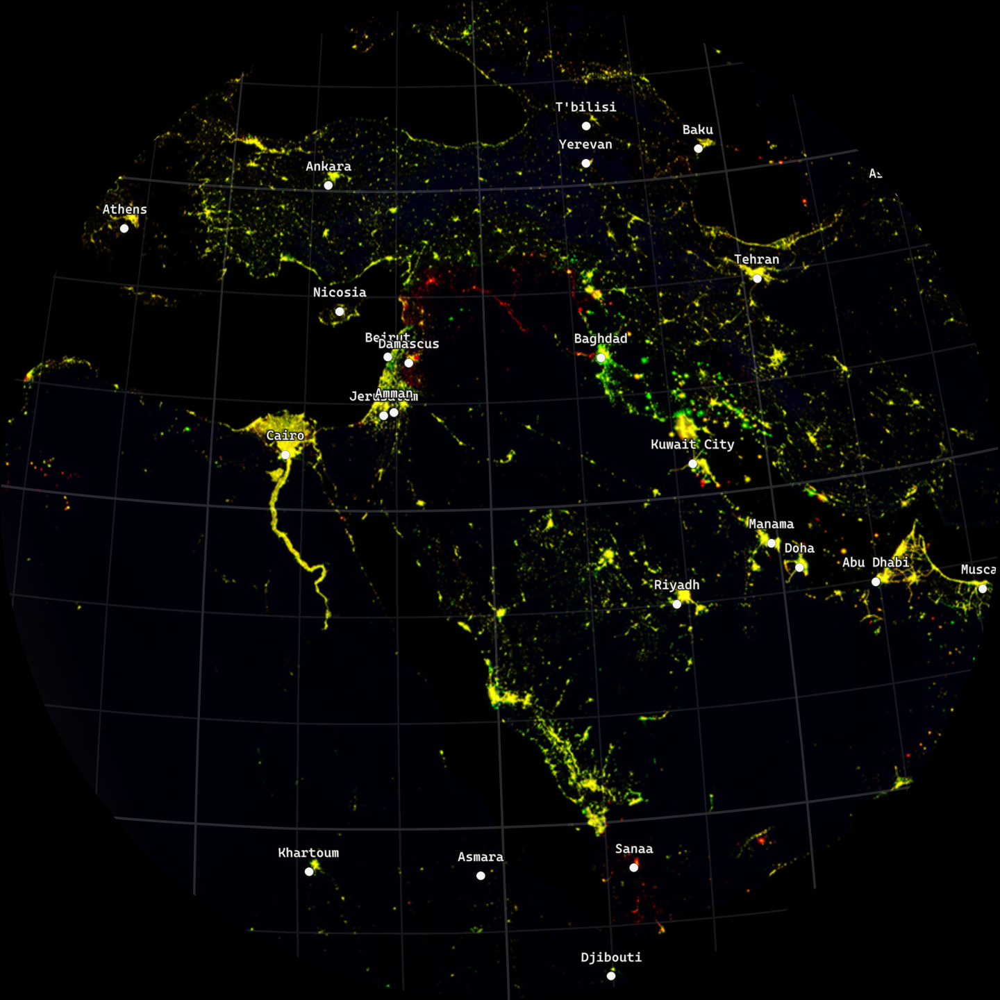

# This is the **World Mod** documentation.

World Mod is a data synthesizer that combines and visualises global
geodata. Users curate their own remix by combining and activating
different thematic areas. The interface invites a variety of settings,
filtering out new perspectives and data layers.

The installation works with a live scripting tool that allows users to
create their own "mods" to develop new scenarios for the digital
globe. Mods are user-defined changes to the software that can be
programmed to load, combine and relate spatial data.

World Mod is a fork of [Fab.Geo](https://github.com/fabSchneider/fab.geo)

Check out the [article section](articles/intro.md) for info on how to use the app.

Check out the [scripting section](scripting/quickstart.md) for infos on how to modify the app.

Check out the [API documentation](api/index.md) for developer information of the C# unity project.

