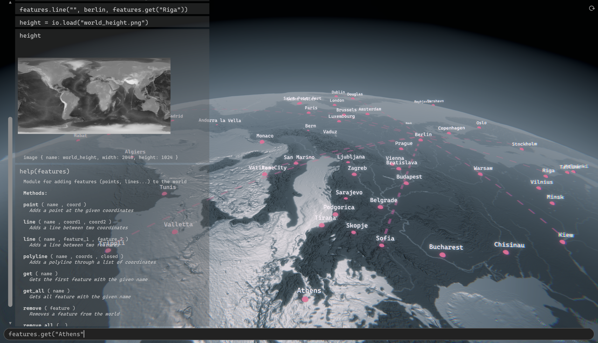

# This is the **World Mod** documentation.

World Mod is a fork of [Fab.Geo](https://github.com/fabSchneider/fab.geo)

Check out the [article section](articles/intro.md) for info on how to use the app.

Check out the [scripting section](scripting/quickstart.md) for infos on how to modify the app.

Check out the [API documentation](api/index.md) for developer information of the C# unity project.

