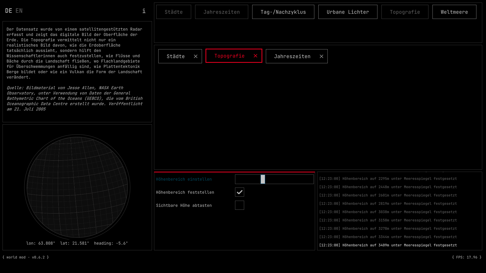
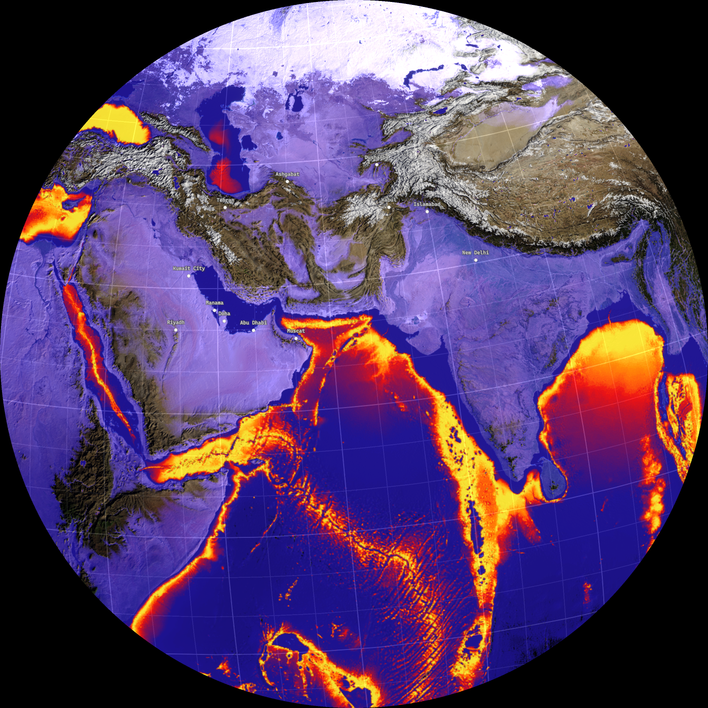

## World Mod

World Mod is a data synthesizer that combines and visualises global
geodata. Users curate their own remix by combining and activating
different thematic areas. The interface invites a variety of settings,
filtering out new perspectives and data layers.

The installation works with a live scripting tool that allows users to
create their own "mods" to develop new scenarios for the digital
globe. Mods are user-defined changes to the software that can be
programmed to load, combine and relate spatial data.

Check out the [documentation](https://fabschneider.github.io/WorldMod/)

